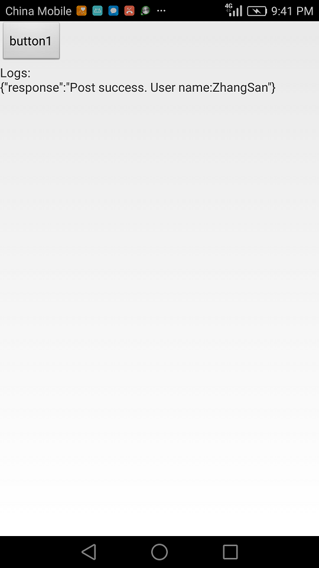
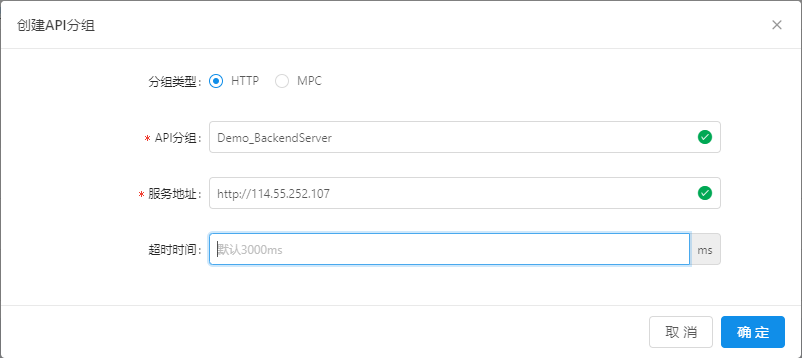
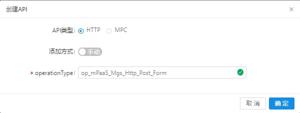

# mPaaS_Mgs_Http_Post_Form

## 描述
本Demo演示APP如何通过mPaaS移动网关(MGS)访问HTTP方法为POST的http api接口，提交一个User对象。

本demo中后端http被调用方式为：

    POST http://114.55.252.107/path_mPaaS_Mgs_Http_Post_Form

## 运行结果

点击button1后，APP打印出后端api返回的内容: {"Response":"post success. User name:Liubin"}

## 操作步骤

(因本demo的运行需要与后端配合，但是本demo中使用的是作者阿里云租户下的后端配置，因此，本demo不支持直接编译运行，否则有可能获得错误的结果。您可以参考以下步骤，完成基于您自己租户下的配置，并成功跑通demo全流程)

### 一、后端API服务设置

##### 1.通过IntelliJ IDEA打开Server目录中的springboot工程，经Maven package打包，您将获得jar包 backend_server-1.0-SNAPSHOT-executable.jar

##### 2.在公网可访问的服务器中，运行该jar包启动后端服务。 

    		java -jar backend_server-1.0-SNAPSHOT-executable.jar

  例如本例在一台IP为114.55.252.107的服务器上运行该jar包，则该后端服务通过URL http://114.55.252.107/path_mPaaS_Mgs_Http_Post_Form对外提供HTTP方法为POST的http api服务。
  
### 二、mPaaS控制台配置

##### 1.点击 mPaaS控制台 ->后台服务管理->移动网关->API分组->创建API分组*

以本 Demo中设置为例：

- API分组: 填写API分组的名字。API分组可以理解为提供一系列api的后端服务。例如实际生产中,有一个提供登录服务的后端服务系统，其提供login、logout一些列http api，我们可以在这里填写LoginService,以代表后端用户登录服务系统。本Demo中，后端服务是一个纯技术的不含任何业务属性的服务, 我们对其命名为Demo_BackendServer。

- 服务地址：后端服务的url (不包含具体api路径)。本demo中设置为http://114.55.252.107 

##### 2.点击 mPaaS控制台 ->后台服务管理->移动网关->API管理->创建API

以本 Demo中设置为例：

- operationType: 对operationType命名。 operationType可以理解为一个具体的api接口。例如实际生产中，对于上述提及的后端登录服务系统的一个登录服务，这里可以填写为login或LoginAPI等用于辨识该接口的命名。因本demo不含任何业务属性，我们对后端demo的接口api在这里命名为op_mPaaS_Mgs_Http_Post_Form

##### 3.点击 mPaaS控制台 ->后台服务管理->移动网关->API管理->op_mPaaS_Mgs_Http_Post_Form->基础信息-修改， 

并在修改后保存和打开本api接口

以本 Demo中设置为例：

其中：

- API名称：在实际项目中填写该api接口(operationType)对操作者友好的有意义名称作为api注释，例如“登录”，“查询余额”。 本Demo因不含任何业务属性，填写了ApiName_mPaaS_Mgs_Http_Post_Form
- 接入系统：选择步骤1中创建的API分组 Demo_BackendServer
- 请求path: 在实际项目中，请求path为后端业务系统实际http api接口的url的路径部分，例如/login , /checkBalance 。 本demo中，后端demo服务提供的api路径为 /path_mPaaS_Mgs_Http_Post_Form .
- 调用方式：后端api的HTTP方法类型。本demo中为POST.

##### 4.点击mPaaS控制台 ->后台服务管理->移动网关->数据模型->创建数据模型

本Demo展示调用HTTP POST的接口向后端服务上传一个User信息。因此，需先行创建一个User模型。 以本Demo中创建的User模型如下：

- 模型名称：所创建模型的名称，也将是后续步骤中生成代码的类名。
- 参数名称和类型： 填写各参数的名称和类型，也将是后续步骤中生成代码中的成员变量名和类型

本demo中将生成的model class如下：

		// Generated by HybirdPB CodeGenerator(1.2.0). DO NOT EDIT!
		// Generation date is 2020-03-01 04:38:45
		
		package com.aliyun.mpaas.demo.android60.launcher.model;
		
		public class User {
			public String name;
			public Integer age;
		}

##### 5.点击 mPaaS控制台 ->后台服务管理->移动网关->API管理->op_mPaaS_Mgs_Http_Post_Form->参数设置-修改

因为后端服务接口需在Http请求体中上传User对象，因此需在控制台接口定义中指定请求Body类型，如下：

 
- 请求body类型：后端Http Api接受的请求体的数据类型，本Demo中设置为所创建的数据模型User.
- 相应结果类型：后端http api返回的结果类型，该结果类型也将由MGS网关透传至客户端并由客户端框架反序列化为可以直接使用的对象。本Demo种因为后端返回的内容以字符串对待，因此使用默认值String.

##### 6.点击 mPaaS控制台 ->后台服务管理->移动网关->API管理->op_mPaaS_Mgs_Http_Post_Form的更多->生成代码

选择platform，并填写PackageName, 提交后自动下载网关代理类模板代码,以供编写APP代码时使用。

以本 Demo中设置为例：

其中：

- platform: 对于本demo,选择Android
- packageName: 填写本网关代理模板类的包名。本demo中填写为com.aliyun.mpaas.demo.android60.launcher
- model目录
- request目录

### 三、移动端代码编写

涉及后端配置，本Demo移动端工程不支持直接编译运行，否则可能会因连接到demo作者租户中的mPaaS应用而得不到预期结果。

本Demo Client目录下的Android客户端工程是基于本Demo库中mPaaS_Framework_HelloWorld工程添加代码而来。 我们建议参考client目录下Android客户端工程代码，基于您自己的mPaaS HelloWorld工程，添加相应代码完成您自己的客户端代码。

与Helloworld工程相比，主要改动文件：

- MainActivity.java
- Demo_backendServerClient.java

关于mPaaS Hello World工程的编写，请参考Demo mPaaS_Framework_HelloWorld 及其readme.md

### 四、编译、安装、运行

  编译、安装后，点击button1执行
